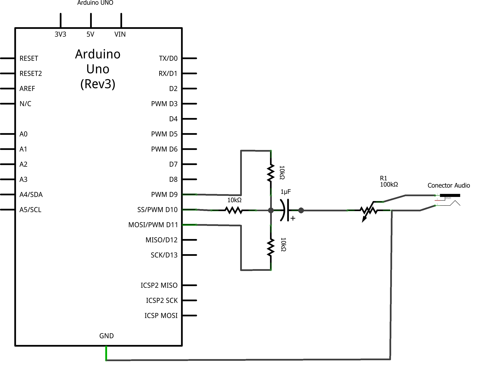
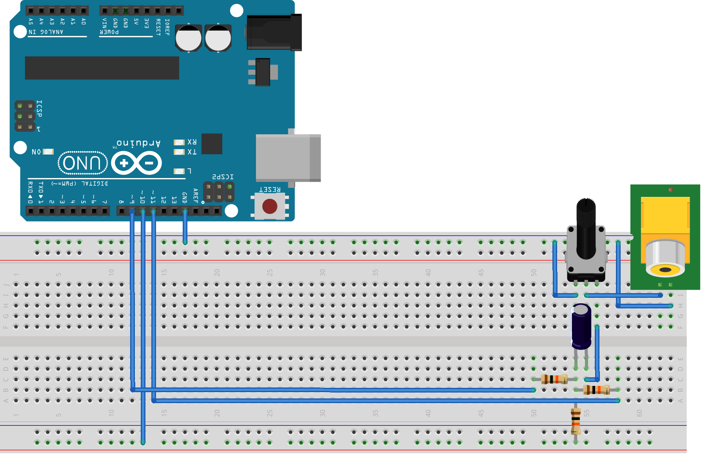

Tones - Sintetizador de audio digital:
======================================

Tones é um pequeno sintetizador de audio que utiliza apenas sinais
digitais. O audio é produzido chaveando portas digitais como no caso
de sinais PWM, porém aqui o duty cicle é fixo (50%), o que muda, no entanto,
é a frequência.

Muitos ajustes tiveram que ser feitos para permitir ao Arduino UNO para que
fosse possível gerar este tipo de sinal a começar pela função micros(). A
função micros() da IDE do Arduino não é precisa o suficiente, marcando o tempo
de 4 em 4 microsegundos. E a precisão necessária era de 1 uS. Por isso
escrevi a biblioteca Time que está inclusa no código.

Outro fator importante é que digitalWrite() é uma função muito lenta, por isso
decidi manipular os Bits individualmente utilizando macros que eu defini em C.
Também está incluso no código.

Também havia um problema com o tamanho das músicas, elas eram muito grandes, 
pois elas são convertidas diretamente de arquivos MIDI. Então tive que utilizar 
a memória de programa para armazenar todos estes dados e só é possível armazenar 
uma música por vez.

Esquemático:
============

Diagrama de ligações:
=====================

OBSERVAÇÔES IMPORTANTES:
========================

1. **NÃO LIGUE AS SAIDAS NO AMPLIFICADOR SEM O CAPACITOR, ISTO QUEIMARÁ O MICROCONTROLADOR!**   
   O circuito está descrito para ser ligado em um aplificador de audio, como as
   caixas de som de um computador, por exemplo.
2. Se desejar ligar **SEM AMPLIFICADOR** em um autofalante comum, deve-se retirar o potenciometro,
   o capacitor e os resistores devem ser ajustados, lembre-se que o Atmega328p pode fornecer
   apenas 40mA por porta (máximo absoluto) e que pode circular um máximo de 200mA pelas portas
   de alimentação do microcontrolador (VCC e GND), ou seja, a soma das saidas não devem ultrapassar
   200mA. Recomendo que utilize resistores de no mínimo 130 Ohms. Isso daria uma corrente de 38.46 mA
   por porta e uma corrente total de 115.38 mA (VCC/GND) supondo que nada mais esteja conectado.

Isenção de responsabilidade:
============================

Quero deixar claro que caso você deseje reconstruír este circuito deve faze-lo por sua conta e risco,
disponibilizo o software e o esquema de hardware como está, e não me responsabilizo por qualquer dano
que possa ser causado nos seus equipamentos.

Licenças:
=========

Inclusas no código fonte, em dois arquivos distintos, um para o Hardware e outro para o Software.
Os arquivos estão nomeados *LICENSE-HARDWARE* e *LICENSE-SOFTWARE*, respectivamente.